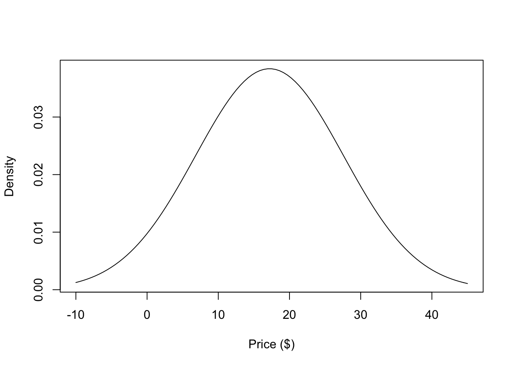
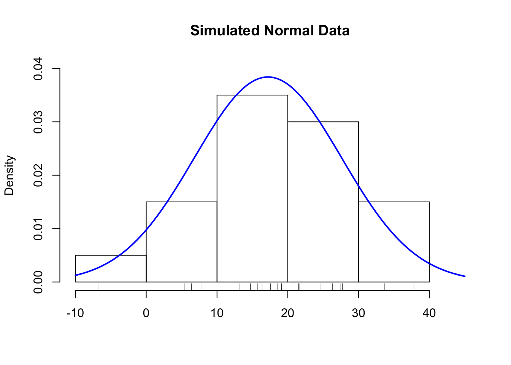
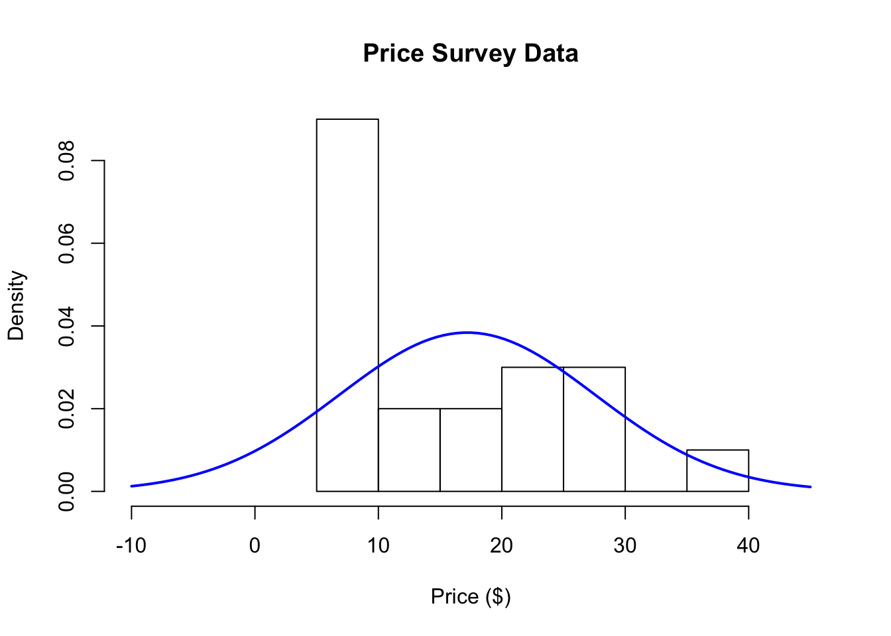
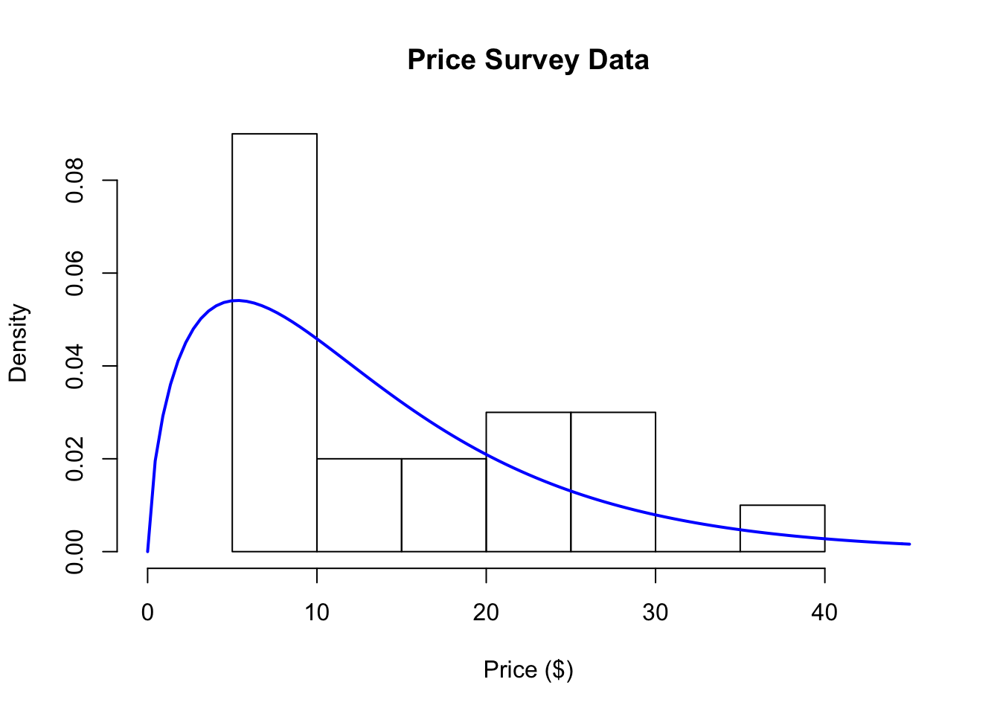
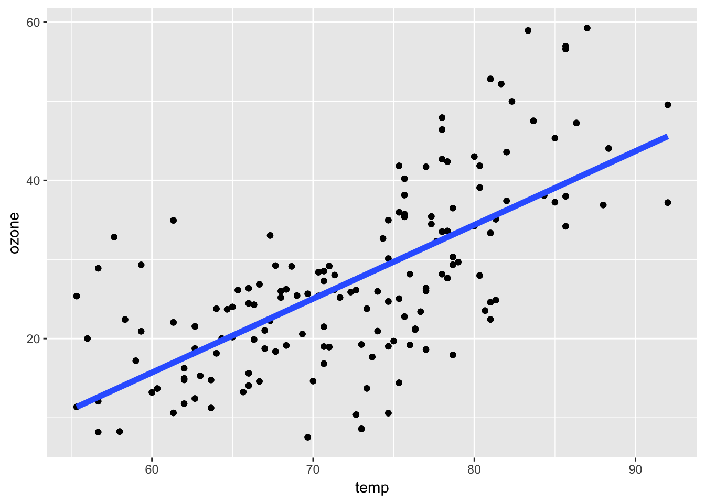
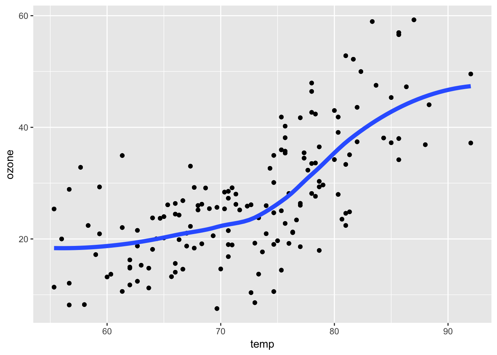

# Using Models to Explore Your Data


The objectives of this chapter are to describe what the concept of a model is more generally, to explain what the purpose of a model is with respect to a set of data, and last, to describe the process by which a data analyst creates, assesses, and refines a model.  In a very general sense, a model is something we construct to help us understand the real world. A common example is the use of an animal which mimics a human disease to help us understand, and hopefully, prevent and/or treat the disease. The same concept applies to a set of data--presumably you are using the data to understand the real world.  

In the world of politics a pollster has a dataset on a sample of likely voters and the pollster's job is to use this sample to predict the election outcome.  The data analyst uses the polling data to construct a model to predict what will happen on election day. The process of building a model involves imposing a specific structure on the data and creating a summary of the data. In the polling data example, you may have thousands of observations, so the model is a mathematical equation that reflects the shape or pattern of the data, and the equation allows you to summarize the thousands of observations with, for example, one number, which might be the percentage of voters who will vote for your candidate.  Right now, these last concepts may be a bit fuzzy, but they will become much clearer as you read on.

A statistical model serves two key purposes in a data analysis, which are to provide a *quantitative summary* of your data and to impose a specific *structure* on the population from which the data were sampled. It's sometimes helpful to understand what a model is and why it can be useful through the illustration of extreme examples. The trivial "model" is simply **no model at all**. 

Imagine you wanted to conduct a survey of 20 people to ask them how much they'd be willing to spend on a product you're developing. What is the goal of this survey? Presumably, if you're spending time and money developing a new product, you believe that there is a large *population* of people out there who are willing to buy this product. However, it's far too costly and complicated to ask everyone in that population what they'd be willing to pay. So you take a *sample* from that population to get a sense of what the population would pay.

One of us (Roger) recently published a book titled [_R Programming for Data Science_](https://leanpub.com/rprogramming). Before the book was published, interested readers could submit their name and email address to the book's web site to be notified about the books publication. In addition, there was an option to specify how much they'd be willing to pay for the book. Below is a random sample of 20 response from people who volunteered this information.


```
25 20 15 5 30 7 5 10 12 40 30 30 10 25 10 20 10 10 25 5
```


Now suppose that someone asked you, "What do the data say?" One thing you could do is simply hand over the data---all 20 numbers. Since the dataset is not that big, it's not like this would be a huge burden. Ultimately, the answer to their question is in that dataset, but having all the data isn't a summary of any sort. Having all the data is important, but is often not very useful. This is because the trivial model provides no reduction of the data.

The first key element of a statistical model is *data reduction*. The basic idea is you want to take the original set of numbers consisting of your dataset and transform them into a smaller set of numbers. If you originally started with 20 numbers, your model should produce a summary that is fewer than 20 numbers. The process of data reduction typically ends up with a *statistic*. Generally speaking, a statistic is any summary of the data. The sample mean, or average, is a statistic. So is the median, the standard deviation, the maximum, the minimum, and the range. Some statistics are more or less useful than others but they are all summaries of the data.

Perhaps the simplest data reduction you can produce is the mean, or the simple arithmetic average, of the data, which in this case is $17.2. Going from 20 numbers to 1 number is about as much reduction as you can do in this case, so it definitely satisfies the summary element of a model.


## Models as Expectations

But a simple summary statistic, such as the mean of a set of numbers, is not enough to formulate a model. A statistical model must also impose some structure on the data. At its core, **a statistical model provides a description of how the world works and how the data were generated**. The model is essentially an *expectation* of the relationships between various factors in the real world and in your dataset. What makes a model a *statistical model* is that it allows for some randomness in generating the data. 


### Applying the normal model

Perhaps the most popular statistical model in the world is the Normal model. This model says that the randomness in a set of data can be explained by the Normal distribution, or a bell-shaped curve. The Normal distribution is fully specified by two parameters---the mean and the standard deviation. 

Take the data that we described in the previous section---the amount of money 20 people were willing to pay for a hypothetical new product. The hope is that these 20 people are a representative sample of the entire population of people who might purchase this new product. If that's the case, then the information contained in the dataset can tell you something about everyone in the population.

To apply the Normal model to this dataset, we just need to calculate the mean and standard deviation. In this case, the mean is $17.2 and the standard deviation is $10.39. Given those parameters, our expectation under the Normal model is that the distribution of prices that people are willing to pay looks something like this.

 


According to the model, about 68% of the population would be willing to pay somewhere between $6.81 and $27.59 for this new product. Whether that is useful information or not depends on the specifics of the situation, which we will gloss over for the moment.

You can use the statistical model to answer more complex questions if you want. For example, suppose you wanted to know "What proportion of the population would be willing to pay more than $30 for this book?" Using the properties of the Normal distribution (and a little computational help from R), we can easily do this calculation.


```r
pnorm(30, mean = mean(x), sd = sd(x), lower.tail = FALSE)
```

```
[1] 0.1089893
```

So about 11% of the population would be willing to pay more than $30 for the product. Again, whether this is useful to you depends on your specific goals. 

Note that in the picture above there is one crucial thing that is missing---the data! That's not exactly true, because we used the data to draw the picture (to calculate the mean and standard deviation of the Normal distribution), but ultimately the data do not appear directly in the plot. In this case **we are using the Normal distribution to tell us what the population looks like**, not what the data look like.

The key point here is that we used the Normal distribution to setup the shape of the distribution that we *expect* the data to follow. The Normal distribution is our expectation for what the data should look like. 


## Comparing Model Expectations to Reality

We may be very proud of developing our statistical model, but ultimately its usefulness will depend on how closely it mirrors the data we collect in the real world. How do we know if our expectations match with reality?

### Drawing a fake picture

To begin with we can make some pictures, like a histogram of the data. But before we get to the data, let's figure out what we *expect* to see from the data. If the population followed roughly a Normal distribution, and the data were a random sample from that population, then the distribution estimated by the histogram should look like the theoretical model provided by the Normal distribution.

In the picture below, I've simulated 20 data points from a Normal distribution and overlaid the theoretical Normal curve on top of the histogram.

 

Notice how closely the histogram bars and the blue curve match. This is what we want to see with the data. If we see this, then we might conclude that the Normal distribution is a **good statistical model for the data**. 

Simulating data from a hypothesized model, if possible, is a good way to setup expectations *before* you look at the data. Drawing a fake picture (even by hand, if you have to) can be a very useful tool for initiating discussions about the model and what we expect from reality. 

For example, before we even look at the data, we might suspect the Normal model may not provide a perfect representation of the population. In particular, the Normal distribution allows for *negative* values, but we don't really expect that people will say that they'd be willing to pay negative dollars for a book. 

So we have some evidence already that the Normal model may not be a *perfect* model, but no model is perfect. The question is does the statistical model provide a reasonable approximation that can be useful in some way?


### The real picture

Here is a histogram of the data from the sample of 20 respondents. On top of the histogram, I've overlaid the Normal curve on top of the histogram of the 20 data points of the amount people say they are willing to pay for the book.

 

What we would *expect* is that the histogram and the blue line should roughly follow each other. How do the model and reality compare?

At first glance, it looks like the histogram and the Normal distribution don't match very well. The histogram has a large spike around $10, a feature that is not present with the blue curve. Also, the Normal distribution allows for negative values on the left-hand side of the plot, but there are no data points in that region of the plot. 

So far the data suggest that the Normal model isn't really a very good representation of the population, given the data that we sampled from the population. It seems that the 20 people surveyed have strong preference for paying a price in the neighborhood of $10, while there are a few people willing to pay more than that. These features of the data are not well characterized by a Normal distribution. 


## Reacting to Data: Refining Our Expectations

Okay, so the model and the data don't match very well, as was indicated by the histogram above. So what do do? Well, we can either

1. Get a different model; or

2. Get different data

Or we could do both. What we do in response depends a little on our beliefs about the model and our understanding of the data collection process. If we felt strongly that the population of prices people would be willing to pay should follow a Normal distribution, then we might be less likely to make major modifications to the model. We might examine the data collection process to see if it perhaps led to some bias in the data. However, if the data collection process is sound, then we might be forced to re-examine our model for the population and see what could be changed. In this case, it's likely that our model is inappropriate, especially given that it's difficult to imagine a valid data collection process that might lead to negative values in the data (as the Normal distribution allows). 

To close the loop here, we will choose a different statistical model to represent the population, the *Gamma distribution*. This distribution has the feature that it only allows positive values, so it eliminates the problem we had with negative values with the Normal distribution.

Now, we should go back to the top of our iteration and do the following:

1. Develop expectations: Draw a fake picture---what do we expect to see before looking at the data?

2. Compare our expectations to the data

3. Refine our expectations, given what the data show

For your reference, here is a histgram of the same data with the Gamma distribution (estimated using the data) overlaid.

 

How do the data match your expectations now?


You might ask what difference does it make which model I use to represent the population from which the data were generated? Well, for starters it might affect the kinds of predictions that you might make using the model. For example, recall before that were interested in what proportion of the population might be willing to pay at least $30 dollars for the book. Our new model says that only about 7% of the population would be willing to pay at least this amount (the Normal model claimed 11% would pay $30 or more). So different models can yield different predictions based on the same data, which may impact decisions made down the road.


## Examining Linear Relationships

It's common to look at data and try to understand linear relationships between variables of interest. The most common statistical technique to help with this task is *linear regression*. We can apply the principles discussed above---developing expectations, comparing our expectations to data, refining our expectations---to the application of linear regression as well.

For this example we'll look at a simple air quality dataset containing information about tropospheric ozone levels in New York City in the year 1999 for months of May through 1999. Here are the first few rows of the dataset.


```
     ozone     temp month
1 25.37262 55.33333     5
2 32.83333 57.66667     5
3 28.88667 56.66667     5
4 12.06854 56.66667     5
5 11.21920 63.66667     5
6 13.19110 60.00000     5
```

The data contain daily average levels of ozone (in parts per billion [pbb]) and temperature (in degrees Fahrenheit). One question of interest that might motivate the collection of this dataset is "How is ambient temperature related to ambient ozone levels in New York?" 

### Expectations

After reading a little about [ozone formation in the atmosphere](https://en.wikipedia.org/wiki/Tropospheric_ozone), we know that the formation of ozone depends critically on the presence of sunlight. Sunlight is also related to temperature in the sense that on days where there is a lot of sunlight, we would expect the average temperature for that day to be higher. Cloudy days have both lower temperatures on average and less ozone. So there's reason to believe that on days with higher temperatures we would expect there to be higher ozone levels. This is an indirect relationship---we are using temperature here as essentially a proxy for the amount of sunlight.

The simplest model that we might formulate for characterizing the relationship between temperature and ozone is a *linear model*. This model says that as temperature increases, the amount of ozone in the atmosphere increases linearly with it. What do we expect this to look like?

We can simulate some data to make a *fake picture* of what the relationship between ozone and temperature should look like under a linear model. Here's a simple linear relationship along with the simulated data in a scatterplot.

 

Note that if you choose any point on the blue line, there are roughly the same number of points above the line as there are below the line (this is also referred to as unbiased errors). Also, the points on the scatterplot appear to increase linearly as you move towards the right on the x-axis, even if there is a quite a bit of noise/scatter along the line.

If we are right about our linear model, and that is the model that characterizes the data and the relationship between ozone and temperature, then roughly speaking, this is the picture we should see when we plot the data.


### Comparing expectations to data

Here is the picture of the actual ozone and temperature data in New York City for the year 1999. On top of the scatterplot of the data, we've plotted the fitted linear regression line estimated using the data.

 

How does this picture compare to the picture that you were expecting to see?

One thing is clear: There does appear to be an increasing trend in ozone as temperature increases, as we hypothesized. However, there are a few deviations from the nice fake picture that we made above. The points don't appear to be evenly balanced around the blue regression line. 

If you draw a vertical line around a temperature of 85 degrees, you notice that most of the points are above the line. Drawing a vertical line around 70 degrees shows that most of the points are below the line. This implies that at higher temperatures, our model is biased downward (it underestimates ozone) and at moderate temperatures our model is biased upwards. This isn't a great feature--in this situation we might prefer that our model is not biased anywhere.

Our simple linear regression model appears to capture the general increasing relationship between temperature and ozone, but it appears to be biased in certain ranges of temperature. It seems that there is room for improvement with this model if we want to better characterize the relationship between temperature and ozone in this dataset.


### Refining expectations

From the picture above, it appears that the relationship between temperature and ozone may not be linear. Indeed, the data points suggest that maybe the relationship is flat up until about 70 degrees and then ozone levels increase rapidly with temperature after that. This suggest a *nonlinear* relationship between temperature and ozone. 

The easiest way we can capture this revised expectation is with a smoother, in this case a loess smoother.

 

This plot shows a different picture--the relationship is slowly increasing up until about 75 degrees, and then sharply increases afterwards. Around 90 degrees, there's a suggestion that the relationship levels off again. 

Smoothers (like loess) are useful tools because they quickly capture trends in a dataset without making any structural assumptions about the data. Essentially, they are an automated or computerized way to sketch a curve on to some data. However, smoothers rarely tell you anything about the mechanism of the relationship and so may be limited in that sense. In order to learn more about the relationship between temperature and ozone, we may need to resort to a more detailed model than the simple linear model we had before.


## When Do We Stop?

In the examples above, we completed one iteration of the data analysis process. In some cases, a single iteration may be sufficient, but in most real-life cases, you'll need to iterate at least a few times. From the examples above, there are still some things left to do:

* **Price Survey Data**: We ended the example by fitting a Gamma distribution model. But how does that fit the data? What would we expect from the data if they truly followed a Gamma distribution (we never made that plot)? Is there a better way to capture that spike in the distribution right around $10?

* **Ozone and Temperature**: The smoother suggested a nonlinear relationship between temperature and ozone, but what is the reason for this? Is the nonlinearity real or just a chance occurrence in the data? Is there a known physical process that explains the dramatic increase in ozone levels beyond a certain temperature and can we model that process?

Ultimately, you might be able to iterate over and over again. Every answer will usually raise more questions and require further digging into the data. When exactly do you stop the process then? Statistical theory suggests a number of different approaches to determining when a statistical model is "good enough" and fits the data well. This is not what we will discuss here, but rather we will discuss a few high-level criteria to determine when you might consider stopping the data analysis iteration.

### Are you out of data?

Iterative data analysis will eventually begin to raise questions that simply cannot be answered with the data at hand. For example, in the ozone/temperature analysis, the modeling suggested that there isn't just a simple relationship between the two variables, that it may be nonlinear. But the data can't explain precisely why such a nonlinear relationship might exist (although they can suggest certain hypotheses). Also, you may need to collect additional data to determine whether what you observe is real or simply a fluke or statistical accident. Either way, you need to go back out into the world and collect new data. More data analysis is unlikely to bring these answers. 

Another situation in which you may find yourself seeking out more data is when you've actually completed the data analysis and come to satisfactory results, usually some interesting finding. Then, it can be very important to try to *replicate* whatever you've found using a different, possibly independent, dataset. In the ozone/temperature example, if we concluded that there were a nonlinear relationship between temperature and ozone, our conclusion might be made more powerful if we could show that this relationship were present in other cities besides New York. Such independent confirmation can increase the strength of evidence and can play a powerful role in decision making. 


### Do you have enough evidence to make a decision?

Data analysis is often conducted in support of decision-making, whether in business, academia, government, or elsewhere, we often collect an analyze data to inform some sort of decision. It's important to realize that the analysis that you perform to get yourself to the point where you can make a decision about something may be very different from the analysis you perform to achieve other goals, such as writing a report, publishing a paper, or putting out a finished product.

That's why it's important to always keep in mind the *purpose* of the data analysis as you go along because you may over- or under-invest resources in the analysis if the analysis is not attuned to the ultimate goal. The purpose of a data analysis may change over time and there may in fact be multiple parallel purposes. The question of whether you have enough evidence depends on factors specific to the application at hand and your personal situation with respect to costs and benefits. If you feel you do not have enough evidence to make a decision, it may be because you are out of data, or because you need to conduct more analysis.


### Can you place your results in any larger context?

Another way to ask this question is "Do the results make some sort of sense?" Often, you can answer this question by searching available literature in your area or see if other people inside or outside your organization have come to a similar conclusion. If your analysis findings hew closely to what others have found, that may be a good thing, but it's not the only desirable outcome. Findings that are at odds with past results may lead down a path of new discovery. In either case, it's often difficult to come to the right answer without further investigation.

You have to be a bit careful with how you answer this question. Often, especially with very large and complex datasets, it's easy to come to a result that "makes sense" and conforms to our understanding of how a given process *should* work. In this situation, it's important to be hyper-critical of our findings and to challenge them as much as possible. In our experience, when the data very closely match our expectation, it can be a result of either mistakes or misunderstandings in the analysis or in the data collection process. It is critical to question every aspect of the analysis process to make sure everything was done appropriately.

If your results do *not* make sense, or the data do not match your expectation, then this is where things get interesting. You may simply have done something incorrectly in the analysis or the data collection. Chances are, that's exactly what happened. For every diamond in the rough, there are 99 pieces of coal. However, on the off-chance that you've discovered something unusual that others have not yet seen, you'll need to (a) make sure that the analysis was done properly and (b) replicate your findings in another dataset. Surprising results are usually met with much scrutiny and you'll need to be prepared to rigorously defend your work. 

Ultimately, if your analysis leads you to a place where you can definitively answer the question "Do the results make sense?" then regardless of how you answer that question, you likely need to **stop your analysis and carefully check every part of it**.


### Are you out of time?

This criterion seems arbitrary but nevertheless plays a big role in determining when to stop an analysis in practice. A related question might be "Are you out of money?" Ultimately, there will be both a time budget and a monetary budget that determines how many resources can be committed to a given analysis. Being aware of what these budgets are, even if you are not necessarily in control of them, can be important to managing a data analysis. In particular, you may need to argue for more resources and to persuade others to given them to you. In such a situation, it's useful to know when to stop the data analysis iteration and prepare whatever results you may have obtained to date in order to present a coherent argument for continuation of the analysis.


## Summary

Model building, like the entire process of data analysis itself, is an iterative process. Models are used to provide data reduction and to give you some insight into the population about which you are trying to make inference. It's important to first set your expectations for a how a model should characterize a dataset before you actually apply a model to data. Then you can check to see how your model conforms to your expectation. Often, there will be features of the dataset that do not conform to your model and you will have to either refine your model or examine the data collection process. 
